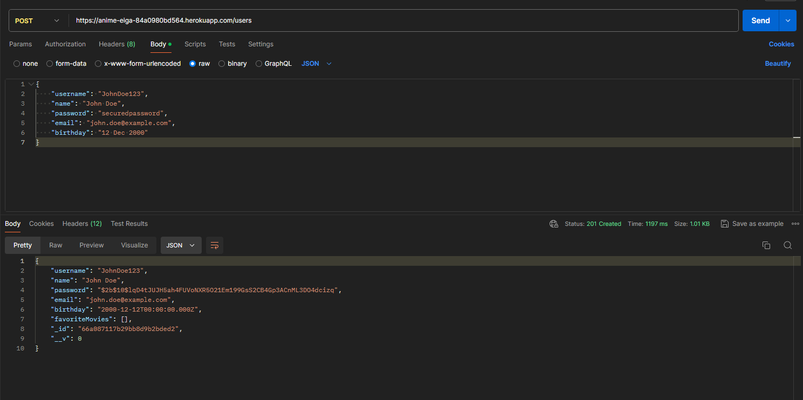

# Anime Eiga (<span class="jp">アニメ 映画</span>) API

## Overview

Welcome to the Anime Films web application! This project focuses on building the server-side component of a comprehensive platform that provides users with access to detailed information about various anime films, directors, and genres. It aims to create a robust and user-friendly API that supports various features for anime enthusiasts.

## Features

- **Anime Film Information:** Access a database of anime films with details about their descriptions, genres, directors, and whether they are featured.
- **Genre and Director Details:** Retrieve information about specific genres and directors.
- **User Authentication:** Users can sign up, log in, and manage their accounts securely.
- **Profile Management:** Users can update their personal information, including name, email, and date of birth.
- **Favorite List:** Users can create and maintain a list of their favorite animes, adding and removing titles as they wish.
- **User Deregistration:** Allow users to delete their accounts if they choose to deregister.

## Technologies Used

- **Server:** Node.js with Express for building the RESTful API.
- **Database:** MongoDB Atlas for storing and managing data, modeled with Mongoose.
- **Middleware:** Utilizing body-parser for reading request data, morgan for logging, and other necessary middleware modules.
- **Testing:** Postman for testing the API endpoints.
- **Security:** 
  - **User Authentication and Authorization:** Using `bcrypt` for hashing passwords, `jsonwebtoken` for creating and verifying JSON Web Tokens, and `passport` along with `passport-jwt` and `passport-local` for implementing authentication strategies.
- **Deployment:** Heroku for hosting and deploying the application.
- **Source Control:** API source code is deployed to a publicly accessible platform like GitHub.
- **Development:** Includes data validation logic, adheres to REST architecture, provides anime information in JSON format, and ensures error-free JavaScript code.
- **Documentation:** JSDoc used for documentation.

## Cloning Repository
Open your terminal and run the following.
```
git clone https://github.com/TheaWin/anime-eiga/git
```

## API Endpoints

#### New User Registration
- **URL:** `/users`
- **HTTP Method:** `POST`
- **Request Body Data Format:** A JSON object holding data about the user to add, structured like:
    ```json
    {
      "username": "JohnDoe123",
      "name": "John Doe",
      "email": "john.doe@example.com",
      "password": "securedpassword",
      "birthday": "12 Dec 2000"
    }
    ```
- **Response Body Data Format:** A JSON object holding data about the user that was added, including an ID:
    ```json
    {
      "id": "1234",
      "username": "JohnDoe123",
      "name": "John Doe",
      "email": "john.doe@example.com",
      "favoriteAnime": "My Neighbor Totoro"
    }
    ```



### [Additional Endpoints](https://anime-eiga-84a0980bd564.herokuapp.com/documentation.html)
- **User Login:** `POST /login`
- **Return a list of ALL animes to the user:** `GET /anime`
- **Return data about a single anime by title:** `GET /anime/[title]`
- **Return data of a list of animes by genre:** `GET /anime/genre/[genreName]`
- **Return data about a director by name:** `GET /anime/directors/[directorName]`
- **Update username info:** `PUT /users/[username]`
- **Add an anime to the user's list of favorites:** `POST /users/[username]/[name]`
- **Remove an anime from the user's list of favorites:** `DELETE /users/[username]/[title]`
- **User deregistration:** `DELETE /users/[username]`
